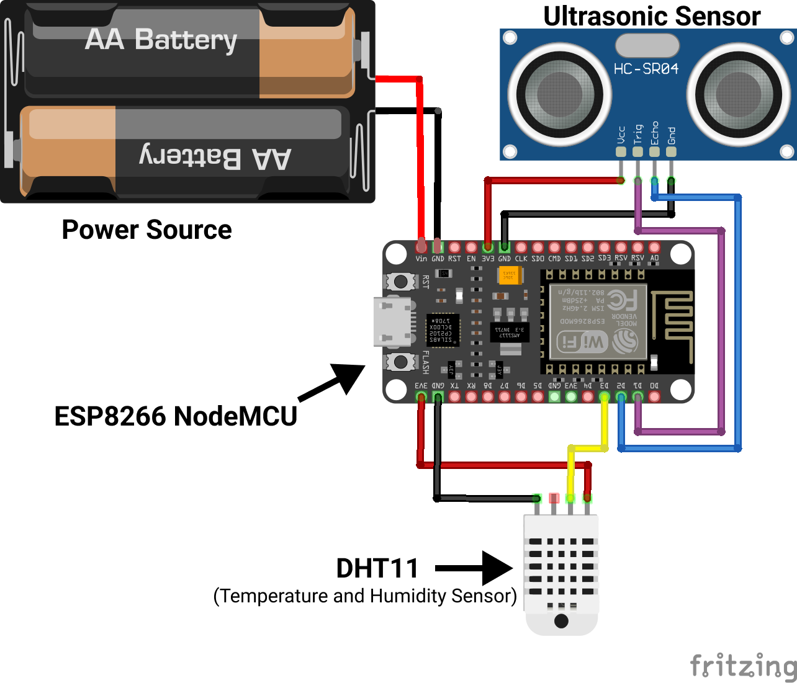

# Pipe Inspection Robot

## Circuit Diagram

## Pin Connections

### Ultrasonic Sensor
trig Pin = D1

Echo Pin = D2

### Temperature and Humidity sensor (DHT11)

VCC = 3.3V on ESP

GND = GND on ESP

DAT = D3
